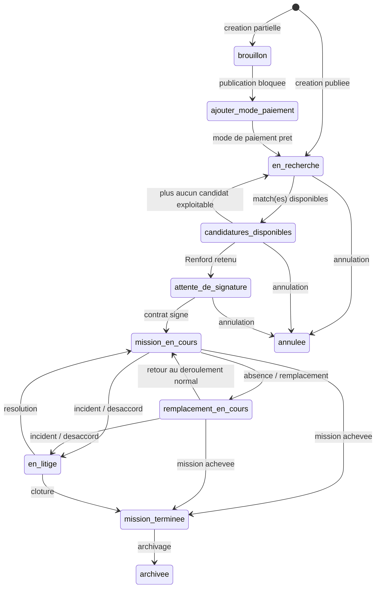
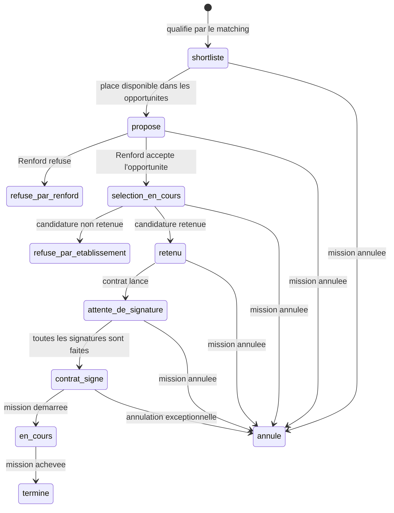
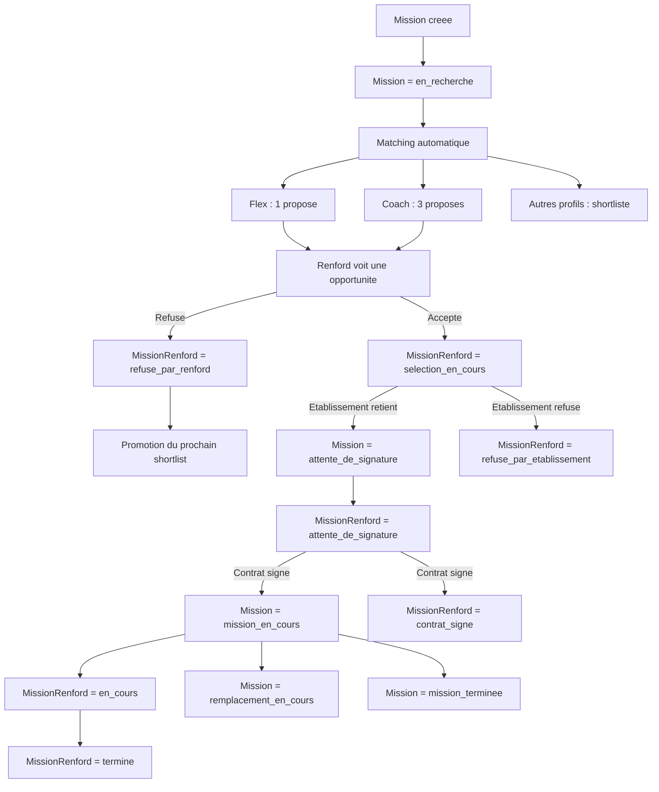

# Mission Flow State

## Objectif

Ce document decrit le cycle d'etat d'une mission RENFORD avec deux niveaux:

- le cycle global de la mission (`Mission.statut`)
- le cycle cote Renford pour une opportunite / candidature (`MissionRenford.statut`)

Il est aligne avec:

- le statut actuel des missions cote etablissement
- le matching automatique apres creation et via scheduler
- les maquettes partagees cote Renford

## 1. Vue simple

Une mission suit deux machines d'etat en parallele:

1. `Mission.statut`
   Cette machine pilote la vie globale de la mission.

2. `MissionRenford.statut`
   Cette machine pilote la relation entre une mission et un Renford donne.

Le point cle est:

- `Mission.statut` dit ou en est la mission pour l'etablissement.
- `MissionRenford.statut` dit ou en est un Renford dans le flux de matching / selection / execution.

## 2. Cycle global de la mission

Etat cible principal:

- `brouillon`
- `ajouter_mode_paiement`
- `en_recherche`
- `candidatures_disponibles`
- `attente_de_signature`
- `mission_en_cours`
- `remplacement_en_cours`
- `en_litige`
- `mission_terminee`
- `archivee`
- `annulee`

### Mermaid - Cycle Mission



## 3. Ce que fait le matching aujourd'hui

Apres creation:

- la mission passe a `en_recherche`
- le matching est lance immediatement
- le scheduler relance le matching toutes les heures

Regle actuelle de proposition:

- mission `flex`:
  - 1 Renford en `propose`
  - les suivants en `shortliste`

- mission `coach`:
  - 3 Renfords en `propose`
  - les suivants en `shortliste`

Si un Renford refuse une proposition:

- son lien MissionRenford sort du flux actif
- le prochain `shortliste` devient `propose`

## 4. Ce que montrent les maquettes cote Renford

Les captures montrent 3 zones UX distinctes:

### A. Opportunites

Ce sont uniquement les missions poussees par l'algo au Renford.

Les badges visibles sont:

- `Nouveau`
- `Vu`

Important:

- `Nouveau` et `Vu` ne sont pas de vrais statuts metier.
- Ce sont des etats de lecture / affichage.
- Ils ne doivent pas vivre dans `StatutMissionRenford`.

### B. Mes candidatures

Les badges visibles sont:

- `Selection en cours`
- `Attente de signature`
- `Accepte`
- `Refuse`

Le sens metier est:

- le Renford a accepte l'opportunite
- l'etablissement etudie ou a statue sur la candidature
- puis on passe au contrat

### C. Mes missions

Les badges visibles sont:

- `Mission en cours`
- `Remplacement en cours`
- `Mission terminee`

Ces badges correspondent surtout au cycle d'execution.

## 5. Probleme de l'enum actuel `StatutMissionRenford`

Enum actuel:

```prisma
enum StatutMissionRenford {
    shortliste
    propose
    accepte
    refuse
    selectionne
    contrat_envoye
    contrat_signe
    en_cours
    termine
    annule
}
```

Les problemes sont:

1. `accepte` est ambigu
   On ne sait pas si:
   - le Renford a accepte l'opportunite
   - ou l'etablissement a accepte la candidature

2. `refuse` est ambigu
   On ne sait pas si:
   - le Renford a refuse
   - ou l'etablissement a refuse

3. `selectionne` chevauche `accepte`
   Les deux semblent exprimer la retention par l'etablissement.

4. `contrat_envoye` est trop technique
   La maquette parle plutot de `Attente de signature`.

5. `Nouveau` / `Vu` ne doivent pas etre des valeurs de cet enum
   Ce sont des flags de lecture, pas des statuts de candidature.

## 6. Enum recommandee pour `MissionRenford`

Pour coller au flow metier et aux maquettes, l'enum recommande est:

```prisma
enum StatutMissionRenford {
    shortliste
    propose
    selection_en_cours
    retenu
    attente_de_signature
    refuse_par_renford
    refuse_par_etablissement
    contrat_signe
    en_cours
    termine
    annule
}
```

### Sens de chaque valeur

- `shortliste`
  Renford qualifie mais pas encore pousse en opportunite active.

- `propose`
  Mission visible dans `Opportunites`.

- `selection_en_cours`
  Le Renford a accepte l'opportunite, la candidature est en cours d'etude.

- `retenu`
  L'etablissement a retenu ce Renford.

- `attente_de_signature`
  Contrat lance, signatures attendues.

- `refuse_par_renford`
  Le Renford refuse l'opportunite.

- `refuse_par_etablissement`
  L'etablissement refuse la candidature.

- `contrat_signe`
  Toutes les signatures sont faites.

- `en_cours`
  Le Renford execute la mission.

- `termine`
  Execution terminee.

- `annule`
  Relation mission/Renford annulee.

## 7. Mermaid - Cycle cote Renford



## 8. Mermaid - Vue combinee mission + Renford



## 9. Champ complementaire recommande pour les maquettes Renford

Pour gerer `Nouveau` / `Vu`, il faut un champ separe sur `MissionRenford`, par exemple:

```prisma
dateVueOpportunite DateTime?
```

Interpretation:

- `dateVueOpportunite == null` -> badge `Nouveau`
- `dateVueOpportunite != null` -> badge `Vu`

## 10. Regle de mapping UX recommandee

### Opportunites

- afficher uniquement `MissionRenford.statut = propose`
- trier d'abord les `Nouveau`, puis les `Vu`

### Mes candidatures

- `selection_en_cours`
- `retenu`
- `attente_de_signature`
- `refuse_par_etablissement`

### Mes missions

- `contrat_signe`
- `en_cours`
- `termine`

En parallele, l'etat de mission globale continue d'etre porte par `Mission.statut`.

## 11. Resume de decision

Le plus important a retenir est:

- `Mission.statut` pilote la mission globale
- `MissionRenford.statut` pilote la candidature / affectation d'un Renford
- `Nouveau` / `Vu` ne doivent pas etre dans l'enum `StatutMissionRenford`
- les valeurs `accepte` et `refuse` doivent etre remplacees par des valeurs explicites sur l'acteur qui a pris la decision

La cible recommande est donc:

```prisma
enum StatutMissionRenford {
    shortliste
    propose
    selection_en_cours
    retenu
    attente_de_signature
    refuse_par_renford
    refuse_par_etablissement
    contrat_signe
    en_cours
    termine
    annule
}
```
