# Flux de Paiement & Cycle de Vie d'une Mission

Ce document décrit le flux réel implémenté dans l'application — du brouillon à l'archivage — en intégrant les statuts de mission et les étapes de paiement. Le paiement repose uniquement sur **Stripe Connect** avec une **Checkout Session post-mission**.

---

## 1. Vue d'ensemble — Diagramme complet

```mermaid
flowchart TD
    START([Établissement crée une mission]) --> CHECK_STRIPE

    CHECK_STRIPE{stripeCustomerId\nexiste ?}
    CHECK_STRIPE -- Non → premier passage --> AJOUTER_PAIEMENT
    CHECK_STRIPE -- Oui --> EN_RECHERCHE

    AJOUTER_PAIEMENT["⚠️ STATUT: ajouter_mode_paiement\nAucun client Stripe créé encore\nL'établissement finalise le profil\n→ Stripe Customer créé automatiquement"]
    AJOUTER_PAIEMENT --> STRIPE_CUSTOMER["Stripe: stripe.customers.create()\nID sauvegardé sur ProfilEtablissement"]
    STRIPE_CUSTOMER --> TRANSITION["Toutes les missions\najouter_mode_paiement → en_recherche"]
    TRANSITION --> EN_RECHERCHE

    %% ─── MATCHING ────────────────────────────────────────────────────────────
    EN_RECHERCHE["🔍 STATUT: en_recherche\nMoteur de matching actif\n(scheduler + matching temps réel)"]
    EN_RECHERCHE --> MATCH{Candidats\ntrouvés ?}

    MATCH -- Oui → profils envoyés --> CANDIDATURES["👥 STATUT: candidatures_disponibles\nProfils proposés à l'établissement\nFlex: tous disponibles · Coach: max 3"]
    MATCH -- Aucun match\nou délai dépassé --> ANNULEE_SEARCH["🚫 STATUT: annulee"]

    CANDIDATURES --> SELECT{Établissement\nretient un Renford ?}
    SELECT -- Annulé --> ANNULEE_CAND["🚫 STATUT: annulee"]
    SELECT -- Oui --> ATTENTE_SIGN

    %% ─── SIGNATURE ───────────────────────────────────────────────────────────
    ATTENTE_SIGN["✍️ STATUT: attente_de_signature\nContrat de prestation généré\nSignature requise des deux parties\n(établissement + Renford)"]
    ATTENTE_SIGN --> SIGNED{Contrat\nsigné ?}
    SIGNED -- Délai / refus --> ANNULEE_SIGN["🚫 STATUT: annulee"]
    SIGNED -- Oui → les deux signent --> MISSION_EN_COURS

    %% ─── MISSION ACTIVE ──────────────────────────────────────────────────────
    MISSION_EN_COURS["▶️ STATUT: mission_en_cours\nMission en cours d'exécution"]

    MISSION_EN_COURS --> INCIDENT{Incident ?}
    INCIDENT -- Absence /\nremplacement --> REMPLACEMENT["🔄 STATUT: remplacement_en_cours\nRecherche d'un Renford remplaçant\nMatching relancé"]
    REMPLACEMENT --> RETOUR{Situation\nrétablie ?}
    RETOUR -- Oui --> MISSION_EN_COURS
    RETOUR -- Non\nou clôture --> MISSION_TERMINEE

    INCIDENT -- Désaccord --> LITIGE["⚖️ STATUT: en_litige\nDossier transmis à l'admin\n💰 Paiement: bloque"]
    LITIGE --> LITIGE_RESOL{Résolution}
    LITIGE_RESOL -- Résolu --> MISSION_EN_COURS
    LITIGE_RESOL -- Clôturé --> MISSION_TERMINEE

    INCIDENT -- Non → mission achevée --> MISSION_TERMINEE
    MISSION_EN_COURS --> ANNULEE_GLOBAL["🚫 STATUT: annulee\n(cas exceptionnels)"]

    %% ─── FIN DE MISSION & PAIEMENT ───────────────────────────────────────────
    MISSION_TERMINEE["🏁 STATUT: mission_terminee\nMission achevée\nÉvaluation Renford disponible"]

    MISSION_TERMINEE --> CHECKOUT_CREATE["💳 Établissement déclenche le paiement\nAPI: POST /paiement/checkout\n→ Stripe Checkout Session créée\n💰 Paiement: en_attente\n(stripeCheckoutSessionId sauvegardé)"]

    CHECKOUT_CREATE --> CHECKOUT_PAGE["Redirection vers\nStripe Checkout (mode: payment)\nL'établissement saisit sa carte"]

    CHECKOUT_PAGE --> WEBHOOK{Webhook Stripe}

    WEBHOOK -- checkout.session.completed --> LIBERE["💰 Paiement: libere\n• stripePaymentIntentId sauvegardé\n• dateCapture + dateLiberation\n• Stripe Transfer automatique\n  vers Renford (destination charge)"]

    WEBHOOK -- checkout.session.expired --> ECHEC["❌ Paiement: echoue\n→ Établissement peut relancer\nun nouveau checkout"]
    ECHEC --> CHECKOUT_CREATE

    LIBERE --> ARCHIVEE

    ARCHIVEE["🗂️ STATUT: archivee\n✅ Mission complétée\nDocuments disponibles:\n  • Contrat de prestation\n  • Facture\n  • Attestation de fin de mission"]
    ARCHIVEE --> END([Fin])

    %% ─── STYLE ───────────────────────────────────────────────────────────────
    style AJOUTER_PAIEMENT fill:#fff3cd,stroke:#f0ad4e
    style EN_RECHERCHE fill:#d1ecf1,stroke:#0c5460
    style CANDIDATURES fill:#d4edda,stroke:#155724
    style ATTENTE_SIGN fill:#fff3cd,stroke:#856404
    style MISSION_EN_COURS fill:#d4edda,stroke:#155724
    style REMPLACEMENT fill:#ffeeba,stroke:#856404
    style LITIGE fill:#f8d7da,stroke:#721c24
    style MISSION_TERMINEE fill:#cce5ff,stroke:#004085
    style CHECKOUT_CREATE fill:#e2d9f3,stroke:#6f42c1
    style CHECKOUT_PAGE fill:#e2d9f3,stroke:#6f42c1
    style LIBERE fill:#d4edda,stroke:#155724
    style ARCHIVEE fill:#d4edda,stroke:#155724
    style ANNULEE_SEARCH fill:#f8d7da,stroke:#721c24
    style ANNULEE_CAND fill:#f8d7da,stroke:#721c24
    style ANNULEE_SIGN fill:#f8d7da,stroke:#721c24
    style ANNULEE_GLOBAL fill:#f8d7da,stroke:#721c24
    style ECHEC fill:#f8d7da,stroke:#721c24
    style STRIPE_CUSTOMER fill:#e2d9f3,stroke:#6f42c1
    style LIBERE fill:#d4edda,stroke:#155724
```



---

## 2. Résumé des statuts de mission

| Statut                     | Description                                                                |
| -------------------------- | -------------------------------------------------------------------------- |
| `brouillon`                | Mission en cours de création (non encore soumise)                          |
| `ajouter_mode_paiement`    | Aucun `stripeCustomerId` sur le profil établissement — publication bloquée |
| `en_recherche`             | Moteur de matching actif, Renford disponibles recherchés                   |
| `candidatures_disponibles` | Profils Renford proposés à l'établissement                                 |
| `attente_de_signature`     | Contrat généré, signature des deux parties requise                         |
| `mission_en_cours`         | Mission active                                                             |
| `remplacement_en_cours`    | Absence détectée, matching relancé pour remplaçant                         |
| `en_litige`                | Incident — paiement bloqué, dossier admin                                  |
| `mission_terminee`         | Mission achevée, paiement Stripe à initier                                 |
| `archivee`                 | Paiement libéré, documents générés, cycle terminé                          |
| `annulee`                  | Mission annulée (possible à plusieurs étapes)                              |

---

## 3. Statuts de paiement (`Paiement.statut`)

| Statut       | Quand                                     | Ce qui se passe                                                                       |
| ------------ | ----------------------------------------- | ------------------------------------------------------------------------------------- |
| `en_attente` | Checkout Session créée                    | Session Stripe ouverte, établissement n'a pas encore payé                             |
| `libere`     | Webhook `checkout.session.completed` reçu | Paiement capturé, transfer Stripe Connect déclenché automatiquement, mission archivée |
| `bloque`     | Litige ouvert par l'admin                 | Paiement suspendu manuellement                                                        |
| `echoue`     | Webhook `checkout.session.expired`        | Session expirée — un nouveau checkout peut être relancé                               |

> **Note :** Le statut `en_cours` n'est pas utilisé dans le flux actuel. Il est réservé pour usage futur.

---

## 4. Calcul des montants

À la création de la mission, les montants sont pré-calculés et stockés :

| Champ                 | Description                                              |
| --------------------- | -------------------------------------------------------- |
| `montantHT`           | Tarif × heures (base sans frais)                         |
| `montantFraisService` | Commission Renford HT (`STRIPE_COMMISSION_PERCENT`)      |
| `montantTTC`          | Total payé par l'établissement (`montantHT + frais TTC`) |
| `montantCommission`   | Frais service TTC (TVA 20% sur frais uniquement)         |
| `montantNetRenford`   | `montantTTC - montantCommission` — reversé au Renford    |

> Si l'établissement a un **abonnement actif dans les quotas**, `montantFraisService = 0` et `montantTTC = montantHT`.

---

## 5. Flux Stripe Connect — Destination Charge

```
Établissement paie via Stripe Checkout
      │
      ▼
Stripe (compte plateforme Renford)
      │
      ├── payment_intent_data.application_fee_amount = montantCommission (TTC)
      │
      └── payment_intent_data.transfer_data.destination = stripeConnectAccountId du Renford
                │
                ▼
           Compte Express Renford (stripe.accounts.create type: express)
                │
                ▼
           Payout automatique Stripe → compte bancaire du Renford
```

---

## 6. Documents générés

| Document                      | Déclenché à                                                            | Format    |
| ----------------------------- | ---------------------------------------------------------------------- | --------- |
| Contrat de prestation         | `attente_de_signature` → `mission_en_cours` (les deux parties signent) | PDF signé |
| Facture                       | Paiement `libere` (webhook `checkout.session.completed`)               | PDF       |
| Attestation de fin de mission | Mission `archivee`                                                     | PDF       |
