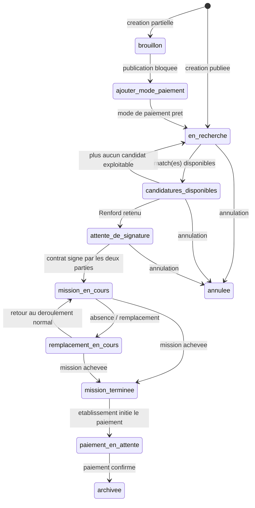

# Flow Existant VS Nouveau Flow De Figma

## 1) Notre modèle existant: comment il fonctionne

### Principe

Notre modèle actuel suit une logique post-mission:

1. La mission est créée et suit son cycle normal (mise en relation, réalisation).
2. Quand la mission est terminée, le paiement est lancé.
3. Le paiement passe par des statuts clairs: en attente, en cours, réussi, échoué, bloqué.
4. Si le paiement réussit, le reversement est confirmé via Stripe Connect et la mission est clôturée/archivée.
5. Si le paiement échoue, l établissement peut relancer le paiement.



### Avantages

1. Il est stable et déjà opérationnel.
2. Il sépare bien la prestation (mission) et la transaction (paiement).
3. Il permet un suivi lisible des statuts de paiement.
4. Il garde un parcours utilisateur relativement simple côté établissement et côté support.

### Point de sécurité important

Notre modèle actuel évite de stocker nous-mêmes les données sensibles de carte et d informations bancaires. C est un point fort à conserver absolument.

## 2) Nouveau Flow du Figma

### Comment il fonctionne

Ce flow démarre au moment de la publication de mission, puis se sépare selon plusieurs branches métier.

1. La mission est publiée.
2. On distingue d abord le type de mission:

- Flex: publication immédiate.
- Coach: attente d acceptation de la mise en relation.

3. Pour Flex, on ajoute ensuite un choix de moyen de paiement:

- Carte bancaire.
- SEPA.

4. Selon le résultat du moyen de paiement:

- paiement validé: la mission continue jusqu à la réalisation.
- paiement non validé: relance ou réessai.

5. Après réalisation de mission:

- paiement final (fin de mission ou logique mensuelle selon le scénario).
- reversement via Stripe Connect.

```
Mission Publiée
  ├─► Renford Flex  ──► Mission publiée immédiatement
  │     └─► Moyen de paiement ?
  │           ├─► Carte Bancaire
  │           │     ├─► Valide    ──► Stripe déclenche paiement ──► Mission publiée
  │           │     └─► Invalide  ──► Mission NON publiée ──► Email établissement (réessayer)
  │           └─► SEPA
  │                 ├─► Mandat validé    ──► Mission publiée
  │                 └─► Mandat non validé ──► Email rappel après X heures
  │
  └─► Renford Coach  ──► Attente acceptation mise en relation
        ├─► Accepte      ──► Email confirmation ──► Mission publiée
        └─► N'accepte pas ──► Mission BLOQUÉE

Mission publiée (tous types)
  └─► Mission réalisée
        └─► Paiement fin de mission / mensuel
              └─► Reversement Renford via Stripe Connect
                    ├─► Fin — Mission Flex CB
                    ├─► Fin — Mission Flex SEPA
                    └─► Fin — Mission Coach
```

## 3) Comparaison des deux

La différence principale est le moment où le paiement devient central dans le parcours.

Dans notre modèle existant, la mission reste le coeur du flow, puis le paiement arrive en fin de cycle. Cela réduit le nombre de décisions à prendre au début et garde un chemin opérationnel court.

Sur les statuts, notre modèle est orienté suivi transactionnel clair autour de quelques états de paiement (en attente, en cours, réussi, échoué, bloqué), tandis que le flow documenté ajoute davantage d états intermédiaires liés au moyen de paiement lui-même (validation carte, validation mandat SEPA, relances spécifiques).

Sur Flex et Coach, notre modèle distingue bien les deux au niveau mission, puis converge vers un cycle paiement proche en fin de parcours. Le flow documenté garde une distinction plus forte plus longtemps, ce qui améliore la lecture métier, mais augmente la charge de conception, de support et de pilotage.

Sur Stripe Connect, les deux approches convergent: l objectif final reste un reversement au Renford. La vraie différence ne se situe pas sur le reversement, mais sur la manière d arriver au paiement.

Sur SEPA, le flow documenté prévoit une logique métier complète (mandat validé/non validé, rappels). Notre modèle existant n est pas structuré aujourd hui autour de cette branche aussi détaillée, ce qui le rend plus simple à opérer mais moins narratif sur ce scénario.

Sur la sécurité et la conformité, notre modèle actuel a l avantage d éviter une logique qui nous pousserait à manipuler ou conserver des informations bancaires sensibles en interne. C est un point de vigilance majeur si on enrichit les branches de paiement en amont.

En résumé: notre modèle est plus direct, plus stable et plus rapide à opérer; le flow documenté est plus détaillé et plus scénarisé, mais demande un cadrage plus strict pour ne pas complexifier inutilement l exécution produit.
