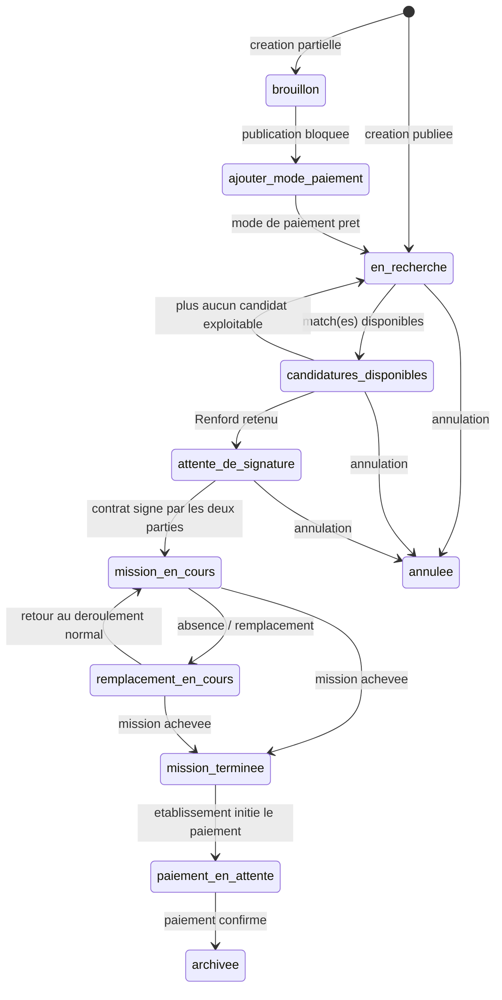

```mermaid
stateDiagram-v2
    [*] --> brouillon : creation partielle
    [*] --> en_recherche : creation publiee

    brouillon --> ajouter_mode_paiement : publication bloquee
    ajouter_mode_paiement --> en_recherche : mode de paiement pret

    en_recherche --> candidatures_disponibles : match(es) disponibles
    candidatures_disponibles --> en_recherche : plus aucun candidat exploitable

    candidatures_disponibles --> attente_de_signature : Renford retenu
    attente_de_signature --> mission_en_cours : contrat signe par les deux parties

    mission_en_cours --> remplacement_en_cours : absence / remplacement
    remplacement_en_cours --> mission_en_cours : retour au deroulement normal

    mission_en_cours --> mission_terminee : mission achevee
    remplacement_en_cours --> mission_terminee : mission achevee

    en_recherche --> annulee : annulation
    candidatures_disponibles --> annulee : annulation
    attente_de_signature --> annulee : annulation

    mission_terminee --> paiement_en_attente : etablissement initie le paiement
    paiement_en_attente --> archivee : paiement confirme
```
