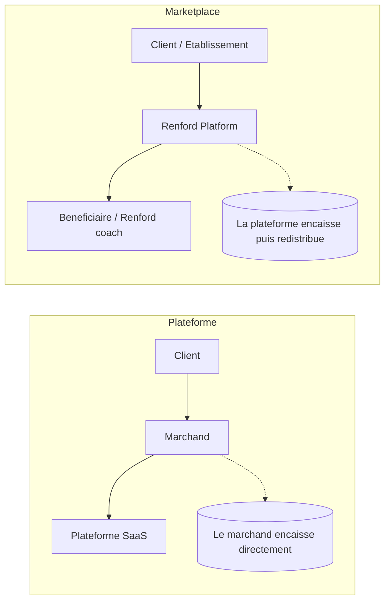
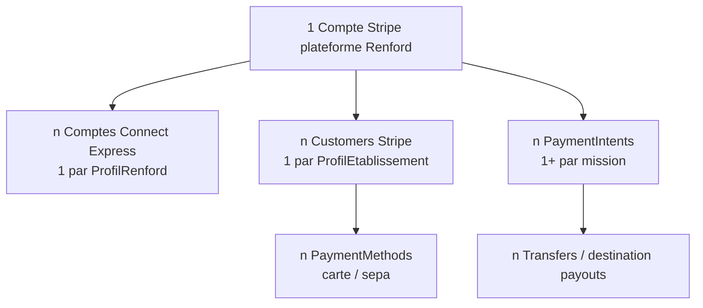
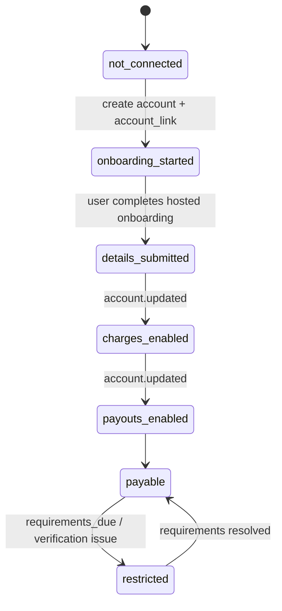
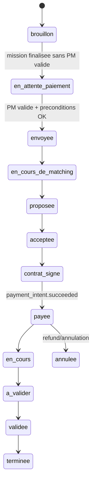
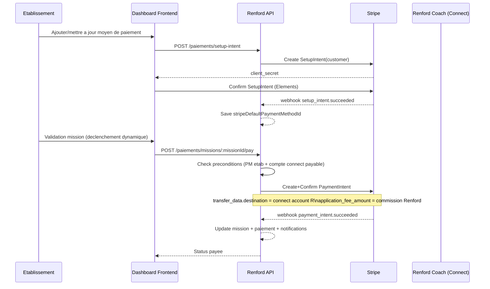
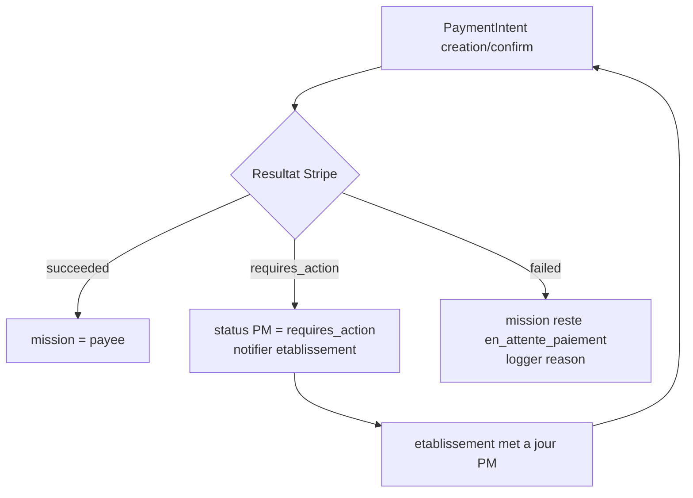

# Plan d'integration Stripe Connect - Renford

Date: 26 mars 2026
Statut: Proposition technique executable

## 1. Objectif

Mettre en place un systeme de paiement marketplace avec Stripe Connect pour:

- Encaisser les etablissements de maniere securisee.
- Payer les Renfords (freelances) sur leur compte Connect.
- Suivre KYC, webhooks, litiges et reconciliation.
- Supprimer tout stockage de donnees carte/SEPA sensibles dans la base Renford.

Ce plan est aligne avec le CDC (paiement securise, automatisation, Stripe Connect, conformite).

## 2. Architecture cible

### 2.1 Type de comptes Stripe

- Plateforme Renford: 1 compte Stripe principal.
- Renford: 1 compte Stripe Connect Express par profil Renford.
- Etablissement: 1 customer Stripe par profil etablissement.

### 2.2 Mode de flux recommande

- Encaissement: PaymentMethod Stripe (Card/SEPA) rattache au customer etablissement.
- Paiement mission:
  - Option recommandee (robuste missions longues):
    - On collecte et valide le moyen de paiement en amont (SetupIntent).
    - On cree le PaymentIntent au bon moment metier (debut mission validee / fin mission selon process), puis capture immediate.
  - Option alternative (missions courtes):
    - PaymentIntent avec capture manuelle si la fenetre d'autorisation le permet.
- Redistribution Renford:
  - Destination charges ou Transfer apres capture.
  - Recommande: PaymentIntent avec transfer_data.destination = compte Connect Renford et application_fee_amount pour la commission plateforme.

### 2.3 Regle de securite cle

Aucune donnee carte brute, CVV, numero, date expiration, IBAN en clair ne doit etre stockee dans PostgreSQL.
Tout passe par Stripe.js/Elements + secrets serveur Stripe.

## 3. Cles, comptes et configuration

## 3.1 Variables d'environnement (API)

- STRIPE_SECRET_KEY
- STRIPE_PUBLISHABLE_KEY
- STRIPE_WEBHOOK_SECRET
- STRIPE_CONNECT_CLIENT_ID
- STRIPE_API_VERSION (optionnel mais recommande pour figer la version)
- STRIPE_DASHBOARD_RETURN_URL (retour onboarding Connect)
- STRIPE_DASHBOARD_REFRESH_URL (retry onboarding Connect)

## 3.2 Variables frontend (dashboard)

- NEXT_PUBLIC_STRIPE_PUBLISHABLE_KEY

## 3.3 Configuration Dashboard Stripe

- Activer Connect (Express).
- Activer moyens de paiement necessaires: card, sepa_debit (si besoin).
- Configurer webhooks (test + prod) vers /api/paiements/webhook.
- Configurer branding et statement descriptor.
- Configurer commissions et pays supportes.

## 4. Flux metier cible

### 4.1 Onboarding Renford (compte Connect)

1. Creer compte Connect Express si absent.
2. Creer Account Link (onboarding KYC).
3. Renford complete KYC sur Stripe Hosted.
4. Webhooks account.updated mettent a jour statut local.
5. Le Renford devient payable quand:
   - details_submitted = true
   - charges_enabled = true (si necessaire)
   - payouts_enabled = true

### 4.2 Onboarding Etablissement (moyen de paiement)

1. Creer customer Stripe si absent.
2. Creer SetupIntent.
3. Frontend confirme SetupIntent via Stripe Elements.
4. Stocker uniquement payment_method_id par defaut + statut.
5. Option SEPA: mandat gere par Stripe (mandate id stocke en reference).

### 4.3 Paiement mission

1. Mission prete a paiement (status metier valide).
2. Verifier:
   - etablissement a un payment_method par defaut valide.
   - renford a un compte Connect eligible.
3. Creer PaymentIntent serveur:
   - amount, currency
   - customer
   - payment_method
   - off_session (si debit auto)
   - confirm = true (si debit immediate)
   - transfer_data.destination = stripeConnectAccountId Renford
   - application_fee_amount = commission Renford
4. Ecouter webhooks payment_intent.succeeded / payment_intent.payment_failed.
5. Mettre a jour mission + table paiements + notifications + bordereau.

### 4.4 Refunds / litiges

- Endpoint support pour remboursement partiel/total (selon role et process metier en place).
- Webhooks charge.dispute.\* et charge.refunded.
- Journalisation complete avec ids Stripe.

## 5. Champs DB a ajouter

Important: ci-dessous, les champs minimaux recommandes par entite.

### 5.1 ProfilRenford (nouveaux champs)

- stripeConnectAccountId String? @unique
- stripeConnectOnboardingComplete Boolean @default(false)
- stripeConnectChargesEnabled Boolean @default(false)
- stripeConnectPayoutsEnabled Boolean @default(false)
- stripeConnectDetailsSubmitted Boolean @default(false)
- stripeConnectCountry String?
- stripeConnectCurrency String?
- stripeConnectLastSyncAt DateTime?
- stripeConnectRequirementsDue Json? (optionnel)

### 5.2 ProfilEtablissement (nouveaux champs)

- stripeCustomerId String? @unique
- stripeDefaultPaymentMethodId String?
- stripePaymentMethodType String? (card, sepa_debit)
- stripePaymentMethodLast4 String? (optionnel affichage)
- stripePaymentMethodBrand String? (optionnel affichage)
- stripeMandateId String? (si SEPA)
- stripePaymentMethodStatus String? (active, requires_action, invalid)
- stripePaymentMethodUpdatedAt DateTime?

### 5.3 Mission (champs Stripe de suivi)

- stripePaymentIntentId String? @unique
- stripeChargeId String?
- stripeTransferId String?
- stripeApplicationFeeAmount Decimal? @db.Decimal(10,2)
- stripeAmountTotal Decimal? @db.Decimal(10,2)
- stripeCurrency String? @default("eur")
- paymentCapturedAt DateTime?
- paymentFailedAt DateTime?
- paymentFailureReason String?

## 5.4 Table Paiement (fortement recommande)

Creer une table dediee paiements plutot que multiplier les champs dans mission.

Champs minimaux proposes:

- id (uuid)
- missionId (FK)
- etablissementId (FK)
- renfordId (FK)
- statut (en_attente, autorise, capture, echoue, rembourse, annule)
- amountTotal, amountCommission, amountRenford
- currency
- stripePaymentIntentId, stripeChargeId, stripeTransferId, stripeRefundId
- paymentMethodType
- metadata Json
- createdAt, updatedAt

## 6. Champs DB a supprimer (securite PCI)

Supprimer ou deprecier les champs de paiement sensibles actuellement stockes en clair:

- Mission.titulaireCarteBancaire
- Mission.numeroCarteBancaire
- Mission.dateExpirationCarte
- Mission.cvvCarte
- Mission.titulaireCompteBancaire
- Mission.IBANCompteBancaire
- Mission.BICCompteBancaire

Remplacement: ids/references Stripe uniquement.

## 7. API a implementer (backend)

### 7.1 Renford Connect

- POST /api/paiements/connect/account-link
  - Creer compte Connect si absent, retourner account_link URL.
- GET /api/paiements/connect/status
  - Retourner statut KYC et eligibilite payout.

### 7.2 Etablissement Payment Method

- POST /api/paiements/setup-intent
  - Retourner client_secret pour sauvegarder moyen de paiement.
- GET /api/paiements/payment-method
  - Retourner resume moyen de paiement actuel.
- DELETE /api/paiements/payment-method
  - Detacher le moyen de paiement par defaut.

### 7.3 Mission Payments

- POST /api/paiements/missions/:missionId/pay
  - Execute paiement mission selon regles metier.
- POST /api/paiements/missions/:missionId/refund
  - Remboursement partiel/total (roles limites).
- GET /api/paiements/missions/:missionId/status
  - Statut detaille (Stripe + metier).

### 7.4 Webhooks

- POST /api/paiements/webhook
  - Valider signature.
  - Traiter events critiques.

## 8. Webhooks Stripe a traiter

Minimum:

- account.updated
- payment_intent.succeeded
- payment_intent.payment_failed
- payment_intent.requires_action
- charge.succeeded
- charge.refunded
- charge.dispute.created
- transfer.created
- payout.paid
- payout.failed

## 9. Evolutions frontend

### 9.1 Renford

- Ecran "Compte de paiement" avec:
  - bouton "Connecter Stripe"
  - statut onboarding KYC
  - erreurs requises

### 9.2 Etablissement

- Ecran "Mode de paiement" via Stripe Elements.
- Affichage masque (brand + last4) et statut de validite.

### 9.3 Mission

- Bloquer publication/paiement si preconditions absentes.
- Messages clairs: moyen de paiement manquant, KYC renford incomplet, paiement refuse, etc.

## 10. Plan de migration recommande

### Phase 1 - Fondations

- Ajouter champs Stripe dans ProfilRenford/ProfilEtablissement.
- Ajouter table Paiement.
- Ajouter module webhook.

### Phase 2 - Connect et moyens de paiement

- Integrer onboarding Connect Renford.
- Integrer SetupIntent et payment method Etablissement.

### Phase 3 - Paiement mission

- Basculer endpoint mission payment vers Stripe PaymentIntent.
- Ecrire dans table Paiement.

### Phase 4 - Cleanup securite

- Supprimer champs carte/IBAN en clair du schema et des formulaires.
- Purger/anonimiser donnees historiques sensibles.

## 11. Risques et points d'attention

- Fenetre capture manuelle carte limitee: preferer debit au bon moment metier pour missions longues.
- KYC incomplet Renford peut bloquer payouts.
- Webhooks obligatoires pour coherence d'etat.
- Idempotency keys Stripe a utiliser pour tous les appels critiques.
- Logs securises sans donnees sensibles.

## 12. Checklist implementation

- [ ] Variables env configurees test/prod
- [ ] Compte Connect Express cree et statut synchronise
- [ ] Customer etablissement + payment method par defaut
- [ ] Paiement mission Stripe operationnel
- [ ] Webhooks verifies et testes
- [ ] Table Paiement alimentee
- [ ] Champs sensibles supprimes
- [ ] Emails/notifications relies aux statuts Stripe
- [ ] Tests E2E paiement (success, failure, refund, dispute)

## 13. Notes de conformite

- PCI DSS: aucune carte brute en DB.
- RGPD: minimisation des donnees et retention stricte.
- Audit: tracer ids Stripe + transitions statut + acteur + horodatage.

## 14. Diagrammes (vue rapide)

### 14.1 Types de business model Stripe (comparaison)

Conclusion pour Renford: modele Marketplace.

### 14.2 Combien de comptes/objets Stripe dans Renford

### 14.3 Statuts Connect Renford (eligibilite paiement)

Condition minimum "payable" (local):

- stripeConnectOnboardingComplete = true
- stripeConnectDetailsSubmitted = true
- stripeConnectChargesEnabled = true
- stripeConnectPayoutsEnabled = true

### 14.4 Statuts mission/paiement dans Renford (vue metier)

### 14.5 Flux paiement Stripe Connect dans l'app Renford

### 14.6 Echecs et reprise (webhook-first)

